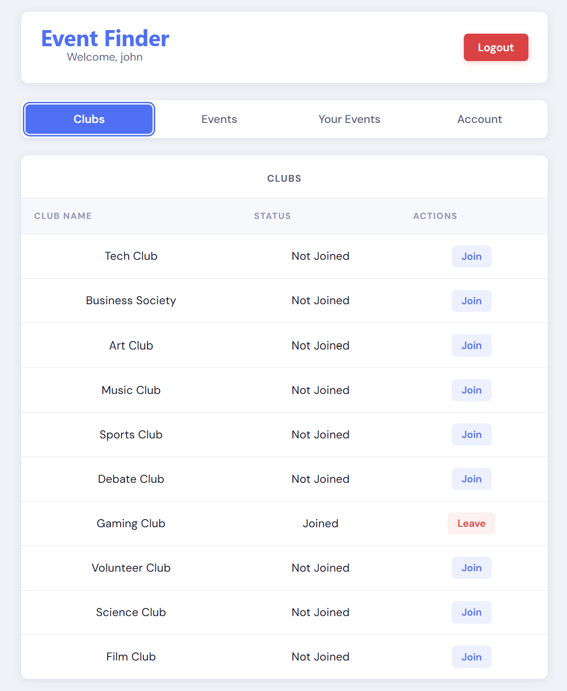
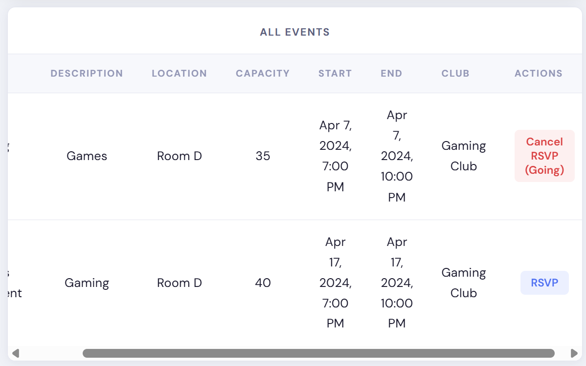

# **Event Finder** #

## **Project Description** ##

Event Finder is a web-based campus event management system built around the problem of fragmented communication between students and campus organizations. On many campuses, event information is spread across multiple platforms such as GroupMe, Slack, or informal announcements, which can make it difficult for students to know where to look for opportunities and easy for organizations to miss potential attendees. This creates a need for a centralized, structured, and reliable system that stores campus activity information in one place. Event Finder addresses this problem by using a database-driven application that models users, organizations, events, memberships, and registrations in a consistent way so campus activities can be easier to manage and access.

## **Features** ##

Event Finder has all the following features:
- Create clubs for specific concentrations
- Create events that fit club description
- RSVP to events that interest each user
- Change passwords
- Encrypted password
- Admins can add/edit/delete any club/event/user

## **Screenshots** ##

Here are some screenshots from our application:


<figure>
  <figcaption>Login Screen</figcaption>
</figure>
<figure>
  
</figure>

<figure>
  <figcaption>Club Screen</figcaption>
</figure>
<figure>
  
</figure>

<figure>
  <figcaption>Event Screen</figcaption>
</figure>
<figure>
  
</figure>


## **Setup & Installation**

### **1. Clone the repository**
```bash
git clone https://github.com/yourusername/event-finder.git
cd event-finder 
```

### **2. Check installations**
Run the following to make sure you have node.js. If you don't have it, install node.js

```bash
node -v
```

Also, run the following to do the rest of the installs

```bash
npm install
```

### **3. Database Setup**
You are going to want to download MySQL Workbench with the following link: https://canvas.vt.edu/courses/223974/pages/mysql-installation-guide

(NOTE: Make sure to remember the port and password you use)

After you install and make a SQL Database, use the file in db/event_finder.sql to import your data in the Workbench.

Before moving on, make sure it is running and take note of the port and password

### **4. Database Connection**
Navigate to the backend folder
```bash
cd ../backend
```
and do the following:
```bash
npm init -y
npm install express mysql2 cors
```

Now, need to add environmental variables so server.js works with your own MySQL credentials

First when in the backend folder, create a new file named '.env'
Inside '.env' create the following varaibles and replace everything after the '=' with your own information

DB_HOST=localhost
DB_USER=root
DB_PASS=password
DB=eventfinder
DB_PORT=3307
JWT_SECRET=secret

where you replace the text with your actual user, pass, and database name.

NOTE: Make sure the .env is in the .gitignore so no one else can see it

(Also, might need to change the port in server.js as I have mine as 3307)

Then you can start backend server:
```bash
node server.js
```

(Can run http://localhost:5000/events in a tab to see if any data shows up to see if it is working)

### **5. Frontend Connection**
Open another tab and
```bash
cd ../frontend
npm install
npm run dev
```

and now everything should start with the data manipulation working.

### **6. Logging In**

NOTE: To get started take a look at event_finder.sql to know what emails you can use. For passwords, all the admins and students have the same password below:
```bash
admin password: "admin123"
student password: "password"
```
